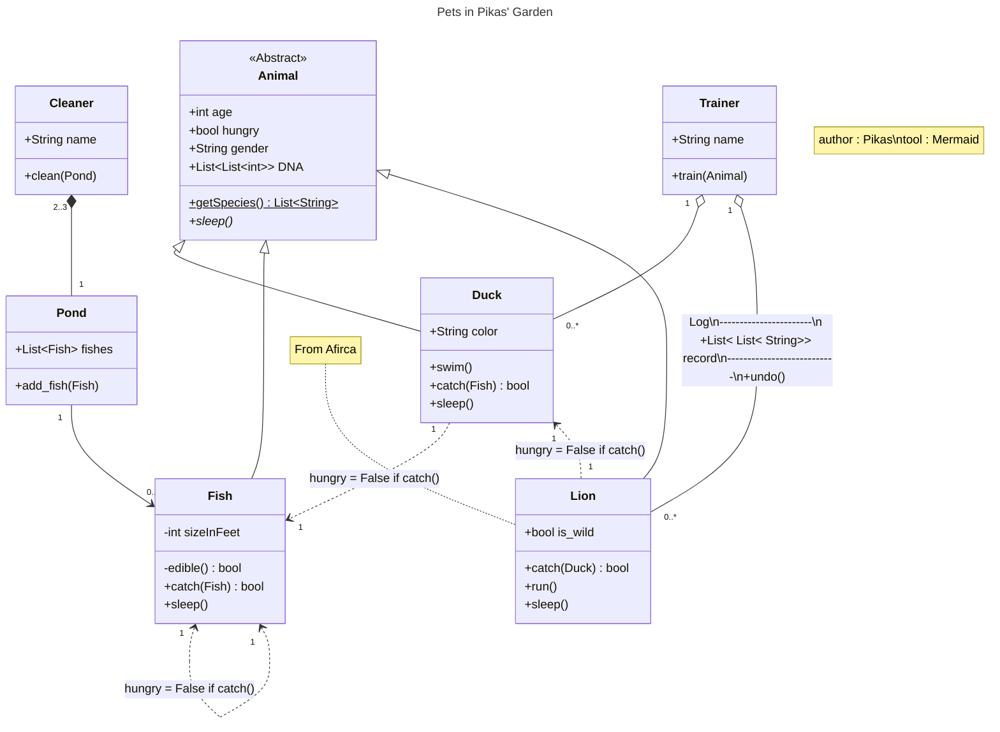

# Class Diagram Drawing Tools

# What is class diagram?

📘 [**簡單理解 UML 類別圖**](https://misomiso43.medium.com/%E7%B0%A1%E5%96%AE%E7%90%86%E8%A7%A3-uml-%E9%A1%9E%E5%88%A5%E5%9C%96-f0b32a3272c)

# Free Tools

## [MIRO](https://miro.com/)

### Result Image


### Features

- Real time collaboration

### Pros

- Free to edit color, font and line style of elements
- Free to edit  text alignment
- Can import images
- Draw instantly online

### Cons

- No function of string replacement

## **[Mermaid](https://mermaid.js.org/)**

### Result Image

[https://mermaid.ink/img/pako:eNqdVGtr2zAU_StCDOa0scnDqV2TFcJKxqAdhe7TMBTVvnFEbSlIMl0fyW-fXktjd-vK_MGPq6N7zj2-uk-44CXgDIdhmDNFVQ0ZugIlEWXoit4R-RF9IaIEljMLKWoi5TkllSBNzpC-GFeAckxateYCZW5XrpNxXuvPSxANoWWOHXrBaENqNH8OQ3TeFnevo0sq16-jF5SzTjRDx5QpRCroh28N8bpllXjoL10rQVmFKmAliP7iBZVqZ2868W6Hzr8t-pAK1PUGCgoyGHxAFutS7g6RGihrgE0wOHLh-XxxK5UghTo785jcV2P9tE48uQDaqyx4zcU-KO9pEwz2nwVRxTowXg2QKfgF55iRC2zdw-TX_2icYxRFZ_7NbNZFOafQJ7QktQREV8jlHnQlGvReYmisl_QRvrIlgNqHoaS3NQQ9Sf_S2pFqVTmB8__VaprlxU7bD1Te3NO67GkyvvQ0iZYd2PwnhbbhV7rXDY3WtxS8QYsVFQX53eUHfusi_JuFv7uGK87KfQ3Id6exYYdW-g7yYI2U5Y0JOo87Yk0azx-Gxs1RFB15Q7uEn2sgDMQhp29ERho4iBYGGJjEXSqfQHNMomiqOY70uXXUBtxl-y4IfRebMsDAHZoun0_hKbgl89W9TJY3QP5_XPAqt8PtL5dedO7Pkbs7nfokCyi4KN_cbHYft6zkwQAPceNmoR63tu4cqzXoYnGmX0tYkbZWpoO2GqrHKb9-YAXOlGhhiNtNSRT4wYuzlemdIdbnTXFx6Ua4neRDvCEMZ0_4J86mcXR6Esfj8TSZpvFklgzxA85maZSO0pNJOptM4tNRkm6H-JFznXSk4clkFqdpkoziZJzObLYfdtHI2P4CGY_Qtw?type=png](https://mermaid.ink/img/pako:eNqdVGtr2zAU_StCDOa0scnDqV2TFcJKxqAdhe7TMBTVvnFEbSlIMl0fyW-fXktjd-vK_MGPq6N7zj2-uk-44CXgDIdhmDNFVQ0ZugIlEWXoit4R-RF9IaIEljMLKWoi5TkllSBNzpC-GFeAckxateYCZW5XrpNxXuvPSxANoWWOHXrBaENqNH8OQ3TeFnevo0sq16-jF5SzTjRDx5QpRCroh28N8bpllXjoL10rQVmFKmAliP7iBZVqZ2868W6Hzr8t-pAK1PUGCgoyGHxAFutS7g6RGihrgE0wOHLh-XxxK5UghTo785jcV2P9tE48uQDaqyx4zcU-KO9pEwz2nwVRxTowXg2QKfgF55iRC2zdw-TX_2icYxRFZ_7NbNZFOafQJ7QktQREV8jlHnQlGvReYmisl_QRvrIlgNqHoaS3NQQ9Sf_S2pFqVTmB8__VaprlxU7bD1Te3NO67GkyvvQ0iZYd2PwnhbbhV7rXDY3WtxS8QYsVFQX53eUHfusi_JuFv7uGK87KfQ3Id6exYYdW-g7yYI2U5Y0JOo87Yk0azx-Gxs1RFB15Q7uEn2sgDMQhp29ERho4iBYGGJjEXSqfQHNMomiqOY70uXXUBtxl-y4IfRebMsDAHZoun0_hKbgl89W9TJY3QP5_XPAqt8PtL5dedO7Pkbs7nfokCyi4KN_cbHYft6zkwQAPceNmoR63tu4cqzXoYnGmX0tYkbZWpoO2GqrHKb9-YAXOlGhhiNtNSRT4wYuzlemdIdbnTXFx6Ua4neRDvCEMZ0_4J86mcXR6Esfj8TSZpvFklgzxA85maZSO0pNJOptM4tNRkm6H-JFznXSk4clkFqdpkoziZJzObLYfdtHI2P4CGY_Qtw?type=png)

### Code



### Features

- Draw w/ code

### Pros

- A code corresponds to a diagram
- Draw instantly online

### Cons

- Messy Lines
- Hard to draw association classes
- Cannot move anything
- Cannot change the color of any class

## **[PlantUML](https://plantuml.com/zh/)**

### Result Image


### Code

```mermaid
@startuml
title Pets in Pikas' Garden
note "author : Pikas\ntool : PlantUML" as nt1

abstract class Animal {
  + int age
  + bool hungry
  + String gender
  + List<List<int>> DNA
  + List<String> getSpecies()
  + sleep()
}

class Duck {
  + String color
  + swim()
  + bool catch(Fish)
}

class Fish{
  - int sizeInFeet
  - bool edible()
  + bool catch(Fish)
}

class  Lion{
  + bool is_wild
  + bool catch(Duck)
  + run()
}

note right of Lion: From Afirca

class Pond {
  + List<Fish> fishes
  + add_fish(Fish)
}

class Cleaner {
  + String name
  + clean(Pond)
}

class Trainer {
  + String name
  + train(Animal)
}

Animal <|-- Duck
Animal <|-- Fish
Animal <|-- Lion

Duck "1" ..> "1" Fish : hungry = False if catch()
Duck "1" <.. "1" Lion : hungry = False if catch()

Fish "1" <..> "1" Fish : hungry = False if catch()

Pond "1" --> "0..*" Fish

Cleaner "2..3" *-- "1" Pond

Trainer "1" o-- "0..*" Duck
Trainer "1" o-- "0..*" Lion : "Log\n---------\n +List< List< String>> record\n---------------------------\n+undo()"
@enduml
```

### Features

- Draw w/ code

### Pros

- A code corresponds to a diagram
- Draw instantly online

### Cons

- Very difficult to draw association classes
- Cannot move anything
- Cannot change the color of any class
- Unknown error occurred. Server response not received.

## **[Draw.io](https://app.diagrams.net/)**

### Result Image


### Features

- Lots of diagram element templates
- Real time collaboration if Google Drive is available

### Pros

- Support italics
- Support underlines
- Support bold
- Many fonts

### Cons

- Ugly UI

### Tutorial

- [流程圖最佳工具(for Free)：Draw.io最佳實作的５個小技巧 - jimmy-wang - Medium](https://medium.com/jimmy-wang/%E6%B5%81%E7%A8%8B%E5%9C%96%E6%9C%80%E4%BD%B3%E5%B7%A5%E5%85%B7-for-free-draw-io%E6%9C%80%E4%BD%B3%E5%AF%A6%E4%BD%9C%E7%9A%84%EF%BC%95%E5%80%8B%E5%B0%8F%E6%8A%80%E5%B7%A7-82955e410e47)

## [Visual Paradigm Online](https://online.visual-paradigm.com/drive/#diagramlist:proj=0&dashboard)

### Result Image


### Features

- Real time collaboration

### Pros

- Lots of templates
- Various diagram are available
- Many fonts

### Cons

- Malfunctioned “Find & Replace”
- Cannot add attribute/method by pressing ENTER
- Cannot edit existing arrows
- Hard to edit size of class blocks
- Unintuitive arrow direction
- Hard to draw association classes
- Things deleted may pop out at unexpected place & timing
- Bad saving
- Bad deleting
- Error message “Unknown error occurred. Server response not received.” often appears
- Big watermark

## **[Excalidraw](https://excalidraw.com/)**

### Result Image


### Features

- Real time collaboration

### Pros

- Free to edit color, font and line style of elements
- Free to edit  text alignment
- Can import images
- Draw instantly online

### Cons

- No italics
- No underlines
- No bold
- Simple arrows only
- Straight arrows only
- No function of string replacement

## **[tldraw](https://www.tldraw.com/)**

### Result Image


### Features

- Real time collaboration

### Pros

- Can import images
- Free to edit color, font and line style of elements
- Draw instantly online
- Beautiful curves

### Cons

- No italics
- No underlines
- No bold
- No solid arrow
- No function of string replacement

## **[StarUML](https://staruml.io/)**

### Result Image


### Features

- Use `[]` to represent **2D array** & **custom class array** instead of `<>`
- Use `Ctrl` to drag the canvas
- Duplicated class block changes with the original one

### Pros

- Free to edit color and font of elements
- Offline
- Can import images

### Cons

- Annoying watermark if unregistered (free ver.)
- Installation is necessary
- Hard to add first attribute/operation
- Not easy to move lines
- No bold
- No function of string replacement
